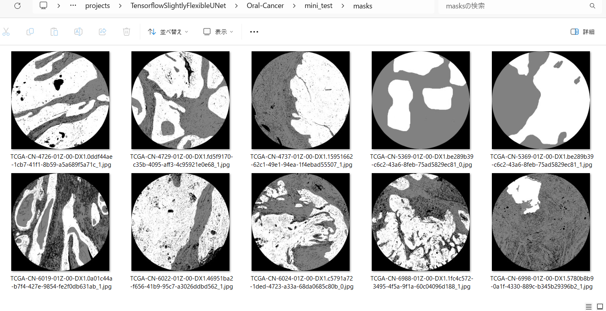
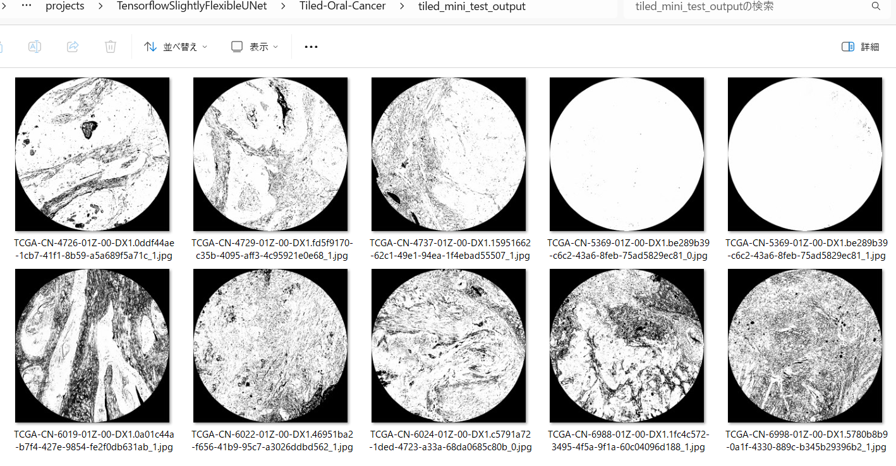

<h2>Tensorflow-Tiled-ImageMask-Segmentation-Oral-Cancer (2024/04/28)</h2>

 
This is an experimental Tiled ImageMask Segmentation project for Oral-Cancer based on
the <a href="https://github.com/sarah-antillia/Tensorflow-Image-Segmentation-API">Tensorflow-Image-Segmentation-API</a>, and
<a href="https://drive.google.com/file/d/1ILujbAFlycxGDieCR-TAi-Iu0afwKnNi/view?usp=sharing">
Tiled-ORCA-ImageMask-Dataset-V2.zip (Random-Shuffled Version)</a>
 
As shown in <a href="https://github.com/sarah-antillia/Tensorflow-Tiled-Image-Segmentation-Oral-Cancer">
Tensorflow-Tiled-Image-Segmentation-Oral-Cancer</a>,
we have already applied a Tiled Image Segmentation strategy to a Oral Cancer Segmentation UNet Model.  
This is the second experiment applying the strategy to the Oral-Cancer Segmentation Model. In this experiment, we used a pre-created Tiledly Splitted ImageMask Dataset to train and validate a UNet model, 
instead of a Size Reduced ImageMask Dataset which was used in 
<a href="https://github.com/sarah-antillia/Tensorflow-Tiled-Image-Segmentation-Oral-Cancer">
the first experiment,</a> 

As already mentioned in <a href="https://github.com/sarah-antillia/Tiled-ImageMask-Dataset-ORCA">Tiled-ImageMask-Dataset-ORCA</a>, 
the pixel-size of the original images and masks in validation and test dataset of
<a href="https://sites.google.com/unibas.it/orca/home?authuser=0">ORCA</a> is 4500x4500, and too large to use for a 
training of an ordinary segmentation model. 
Therefore, Tiled-Image-Segmentation may be effective to infer any segmentation regions for the large images. 
  
In this experiment, we employed the following strategy: 
<b>
1. We trained and validated a TensorFlow UNet model using the Tiled Oral Cancer ImageMask Dataset, which 
was Tiledly-Splitted Dataset of 512x512 pixels, not reduced to 512x512 from the original 4500x4500.  
2. We applied the Tiled-Image Segmentation inference method to predict the segmentation regions for a test image
 with a resolution of 4500x4500 pixels. 
 
</b>  
 
 

Actual Tiled Image Segmentation Sample for an image of 4500x4500 pixel size. 
<table>
<tr>
<th>Input: image</th>
<th>Mask (ground_truth)</th>
<th>Prediction: tiled_inferred_mask</th>
</tr>
<tr>
<td></td>

<td></td>
<!--
<td></td>
 -->
<td></td>
</tr>
</table>

 
In this experiment, we have used the simple UNet Model 
<a href="./src/TensorflowUNet.py">TensorflowSlightlyFlexibleUNet</a> for this Oral Cancer Segmentation. 
As shown in <a href="https://github.com/sarah-antillia/Tensorflow-Image-Segmentation-API">Tensorflow-Image-Segmentation-API</a>.
you may try other Tensorflow UNet Models: 

<li><a href="./src/TensorflowSwinUNet.py">TensorflowSwinUNet.py</a></li>
<li><a href="./src/TensorflowMultiResUNet.py">TensorflowMultiResUNet.py</a></li>
<li><a href="./src/TensorflowAttentionUNet.py">TensorflowAttentionUNet.py</a></li>
<li><a href="./src/TensorflowEfficientUNet.py">TensorflowEfficientUNet.py</a></li>
<li><a href="./src/TensorflowUNet3Plus.py">TensorflowUNet3Plus.py</a></li>
<li><a href="./src/TensorflowDeepLabV3Plus.py">TensorflowDeepLabV3Plus.py</a></li>

 

<h3>1. Dataset Citation</h3>
The original dataset used here has been taken from the following web-site 
<b>ORCA: ORal Cancer Annotated dataset</b> 
<pre>https://sites.google.com/unibas.it/orca/home</pre>

<pre>
If you use the ORCA data, please cite:
F.  Martino,  D.D.  Bloisi,  A.  Pennisi,  M. Fawakherji,  G. Ilardi,  D. Russo,  D. Nardi,  S. Staibano, F. Merolla
"Deep Learning-based Pixel-wise Lesion Segmentation on Oral Squamous Cell Carcinoma Images"
Applied Sciences: 2020, 10(22), 8285; https://doi.org/10.3390/app10228285  [PDF]
</pre>
 

 

<h3>
<a id="2">
2 Tiled Oral Cancer ImageMask Dataset
</a>
</h3>
 If you would like to train this Tiled-Oral-Cancer Segmentation model by yourself,
 please download the latest normalized dataset from the google drive 
<a href="https://drive.google.com/file/d/1ILujbAFlycxGDieCR-TAi-Iu0afwKnNi/view?usp=sharing">
Tiled-ORCA-ImageMask-Dataset-V2.zip</a>. 

 
Please expand the downloaded ImageMaskDataset and place them under <b>./dataset</b> folder to be
<pre>
./dataset
└─Tiled-Oral-Cancer
    ├─test
    │   ├─images
    │   └─masks
    ├─train
    │   ├─images
    │   └─masks
    └─valid
        ├─images
        └─masks
</pre>
 
<b>Tiled Oral Cancer ImageMask Dataset Statistics</b> 
 
 
As shown above, the number of images of train and valid dataset is not necessarily large. 
 

 
<b>Train_images_sample</b> 

 
<b>Train_masks_sample</b> 

 

<h3>
4 Train TensorflowUNet Model
</h3>
 We have trained Tiled-Oral-Cancer TensorflowUNet Model by using the following
<a href="./projects/TensorflowSlightlyFlexibleUNet/Tiled-Oral-Cancer/train_eval_infer.config"> <b>train_eval_infer.config</b></a> file.  
Please move to ./projects/Tiled-Oral-Cancer and run the following bat file. 
<pre>
>1.train.bat
</pre>
, which simply runs the following command. 
<pre>
>python ../../../src/TensorflowUNetTrainer.py ./train_eval_infer.config
</pre>
<pre>
; train_eval_infer.config
; 2024/04/28 (C) antillia.com

[model]
model         = "TensorflowUNet"
generator     = False
image_width    = 512
image_height   = 512
image_channels = 3
input_normalize = False
num_classes    = 1
base_filters   = 16
base_kernels   = (5,5)
num_layers     = 7
dropout_rate   = 0.08
learning_rate  = 0.0001
clipvalue      = 0.5
dilation       = (2,2)
loss           = "bce_dice_loss"
metrics        = ["binary_accuracy"]
show_summary   = False

[train]
epochs        = 100
batch_size    = 4
patience      = 10
;metrics       = ["iou_coef", "val_iou_coef"]
metrics       = ["binary_accuracy", "val_binary_accuracy"]
model_dir     = "./models"
eval_dir      = "./eval"
image_datapath = "../../../dataset/Tiled-Oral-Cancer/train/images/"
mask_datapath  = "../../../dataset/Tiled-Oral-Cancer/train/masks/"
create_backup  = False
learning_rate_reducer = True
reducer_patience      = 4
save_weights_only = True

[eval]
image_datapath = "../../../dataset/Tiled-Oral-Cancer/valid/images/"
mask_datapath  = "../../../dataset/Tiled-Oral-Cancer/valid/masks/"

[test] 
image_datapath = "../../../dataset/Tiled-Oral-Cancer/test/images/"
mask_datapath  = "../../../dataset/Tiled-Oral-Cancer/test/masks/"

[infer] 
images_dir    = "./mini_test/images"
output_dir    = "./mini_test_output"
;merged_dir   = "./mini_test_output_merged"
;binarize      = True
sharpening   = True

[tiledinfer] 
overlapping = 64
split_size  = 512
images_dir  = "./mini_test/images"
output_dir  = "./tiled_mini_test_output"
; default bitwise_blending is True
bitwise_blending =False
sharpening   = True
;merged_dir  = "./tiled_mini_test_output_merged"

[segmentation]
colorize      = True
black         = "black"
white         = "green"
blursize      = None

[mask]
blur      = False
blur_size = (3,3)
binarize  = True
threshold = 127
</pre>

The training process has just been stopped at epoch 54 by an early-stopping callback as shown below.  
 
 
 
<a href="./projects/TensorflowSlightlyFlexibleUNet/Tiled-Oral-Cancer/eval/train_metrics.csv">train_metrics.csv</a> 
 

 
<a href="./projects/TensorflowSlightlyFlexibleUNet/Tiled-Oral-Cancer/eval/train_losses.csv">train_losses.csv</a> 
 

 

<h3>
5 Evaluation
</h3>
Please move to a <b>./projects/TensorflowSlightlyFlexibleUNet/Tiled-Oral-Cancer</b> folder, 
and run the following bat file to evaluate TensorflowUNet model for Tiled-Oral-Cancer. 
<pre>
./2.evaluate.bat
</pre>
<pre>
python ../../../src/TensorflowUNetEvaluator.py ./train_eval_infer_aug.config
</pre>
Evaluation console output: 

  
<a href="./projects/TensorflowSlightlyFlexibleUNet/Tiled-Oral-Cancer/evaluation.csv">evaluation.csv</a> 
The loss (bce_dice_loss) score for this test dataset is low as shown below. 
<pre>
loss,0.1103
binary_accuracy,0.9415
</pre>

<h3>
6 Inference
</h3>
Please move to a <b>./projects/TensorflowSlightlyFlexibleUNet/Tiled-Oral-Cancer</b> folder 
,and run the following bat file to infer segmentation regions for images by the Trained-TensorflowUNet model for Tiled-Oral-Cancer. 
<pre>
./3.infer.bat
</pre>
<pre>
python ../../../src/TensorflowUNetInferencer.py ./train_eval_infer_aug.config
</pre>
mini_test_images 
 
mini_test_mask(ground_truth) 
 

Inferred test masks 
 
 

<h3>
7 Tiled Inference
</h3>
Please move to a <b>./projects/TensorflowSlightlyFlexibleUNet/Tiled-Oral-Cancer</b> folder 
,and run the following bat file to infer segmentation regions for images by the Trained-TensorflowUNet model for Tiled-Oral-Cancer. 
<pre>
./4.infer_tiles.bat
</pre>
<pre>
python ../../../src/TensorflowUNetTiledInferencer.py ./train_eval_infer_aug.config
</pre>

 
Tiled inferred test masks 
 
 

<b>Enlarged Masks Comparison</b> 
As shown below, the tiled-inferred-masks seem to be slightly clear than non-tiled-inferred-masks. 

<table>
<tr>
<th>Mask (ground_truth)</th>
<th>Non-tiled-inferred-mask</th>
<th>Tiled-inferred-mask</th>
</tr>

<tr>
<td></td>
<td></td>
<td></td>
</tr>

<tr>
<td></td>
<td></td>
<td></td>
</tr>

<tr>
<td></td>
<td></td>
<td></td>
</tr>

<tr>
<td></td>
<td></td>
<td></td>
</tr>
</table>
 
 
As shown below, the tiled-inferred-mask contains more detailed pixel level information than the non-tiled-inferred-mask. 
 
<table>
<tr>
<th>Non-tiled-inferred-mask</th>
<th>Tiled-inferred-mask</th>
</tr>
<tr>
<td></td>
<td></td>
</tr>
</table>
 
 

<h3>
References
</h3>
<b>1. ORCA  ORal Cancer Annotated dataset</b> 
<pre> 
https://sites.google.com/unibas.it/orca/home?authuser=0
</pre>
 

<b>2. Deep Learning-Based Pixel-Wise Lesion Segmentation on Oral Squamous Cell Carcinoma Images</b> 
Francesco Martino, Domenico D. Bloisi, Andrea Pennisi,Mulham Fawakherji,Gennaro Ilardi, 
Daniela Russo,Daniele Nardi,Stefania Staibano,and Francesco Merolla 
<pre>
https://www.mdpi.com/2076-3417/10/22/8285
</pre>
 
<b>3. WSI tumor regions segmentation</b> 
Dalí Freire 
<pre>
https://github.com/dalifreire/tumor_regions_segmentation
</pre>
 
<b>4. Tiled-ImageMask-Dataset-ORCA</b> 
Toshiyuki Arai antillia.com 

<pre>
https://github.com/sarah-antillia/Tiled-ImageMask-Dataset-ORCA
</pre>

<b>5. Tensorflow-Tiled-Image-Segmentation-Oral-Cancer</b> 
Toshiyuki Arai antillia.com 

<pre>
https://github.com/sarah-antillia/Tensorflow-Tiled-Image-Segmentation-Oral-Cancer
</pre>

